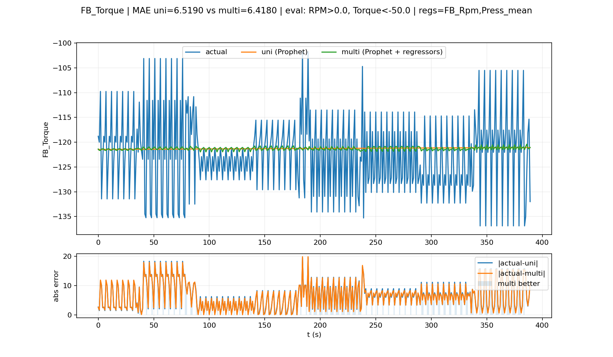
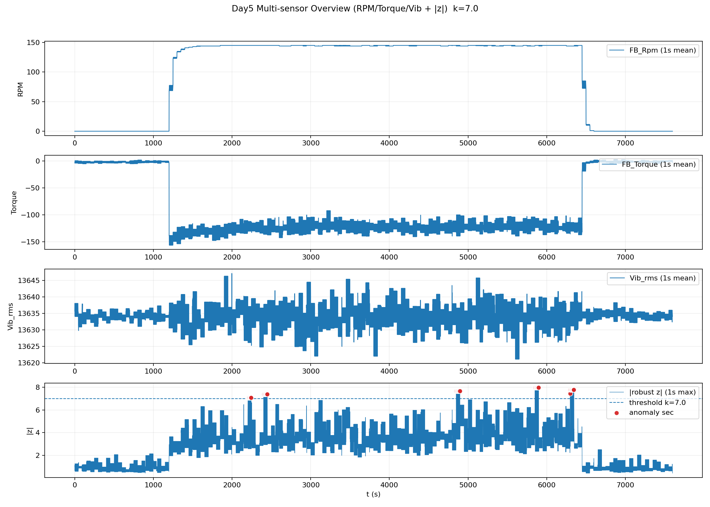
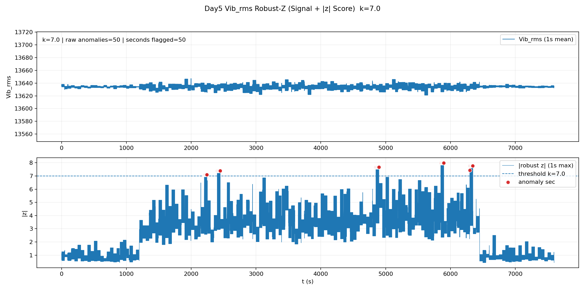

# 📊 다이나모미터 센서 데이터 분석 및 이상 탐지

다이나모미터에서 수집된 다중 센서 시계열 데이터를 전처리하고, 센서 간 관계 분석 → Prophet 기반 예측 → 이상치 탐지까지 수행한 인턴십 프로젝트입니다.

## 🛠 Tech Stack

- **Language**: Python
- **Data Processing**: Pandas, NumPy
- **Forecasting**: Prophet
- **Visualization**: Matplotlib
- **Analysis**: Correlation Analysis, Time-series Forecasting, Anomaly Detection

## 🔄 Analysis Flow

1. 원본 CSV 전처리 및 run 단위 분리
2. 반복되는 상대 시간축을 연속 시간축으로 변환
3. 온도·압력·진동 등 다중 센서 대표값 생성
4. 센서 간 관계 및 상관 분석
5. Prophet 기반 단변량 예측
6. RPM / Pressure를 활용한 다변량 예측
7. Vib_rms 기반 이상치 탐지 및 이벤트 구간 시각화

## 📈 Representative Results

### Prophet Forecast

  

단변량 예측과 다중 센서 정보를 활용한 예측 결과를 비교했습니다.

### Multi-sensor Anomaly Overview

  

RPM, Torque, Vibration 등의 흐름과 이상치 후보 구간을 함께 확인할 수 있도록 시각화했습니다.

### Vibration Robust Score

  

진동 데이터의 robust z-score를 이용해 이상치 후보를 탐지하고 이벤트 단위로 분석했습니다.

## 📂 Analysis Modules

- `data_make.py`: 원본 데이터 정리, run_id 및 연속 시간축 생성, 스케일 적용, 대표 센서 생성
- `data_summary.py`: 결측치, 기초 통계, run 요약 등 데이터 상태 분석
- `features.py`: Temp / Press / Vib 기반 대표값 및 파생변수 생성
- `day1_figures_abs_time.py`: 주요 센서 시간 변화 시각화
- `day2_relationship.py`: 센서 간 관계 및 상관 분석
- `day3_forecast_univariate.py`: Prophet 단변량 예측
- `day4_forecast_multisensor.py`: 다중 센서 회귀변수를 활용한 Prophet 예측
- `day5_anomaly_detection.py`: 진동 기반 이상치 탐지 및 이벤트 시각화

## 📄 Report

- [최종 분석 보고서](reports/final/센서데이터예측_최종보고서.pdf)

## 📌 Note

원본 CSV는 저장소에 포함하지 않았으며, 분석 코드·노트북·그래프·결과 테이블과 보고서를 중심으로 정리했습니다.
